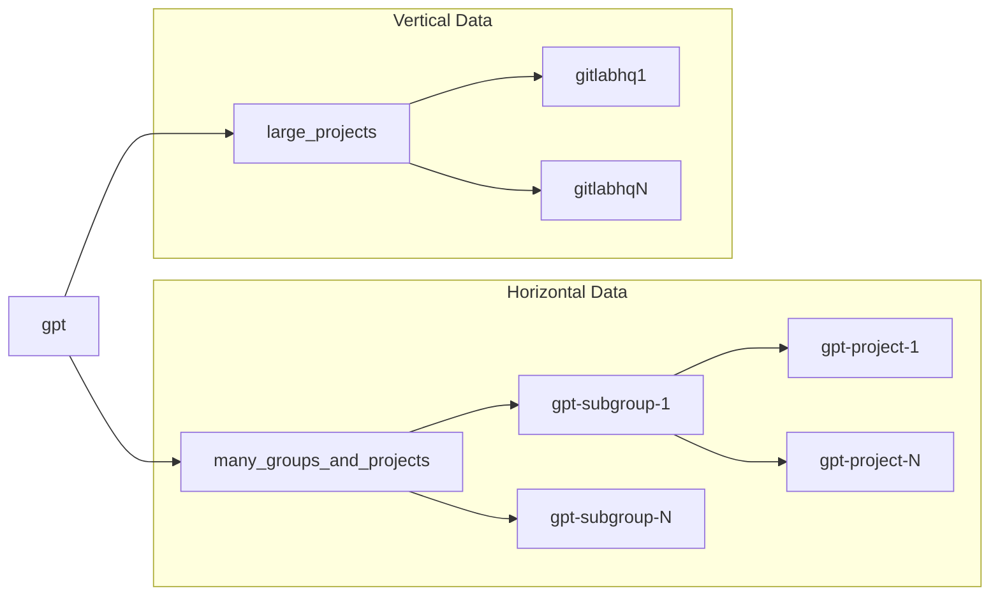

# GitLab Performance Tool - Preparing the Environment

* [**GitLab Performance Tool - Preparing the Environment**](environment_prep.md)
* [GitLab Performance Tool - Running Tests](k6.md)

Before running the GitLab Performance Tool, you'll need to setup the required test data on the environment. This environment preparation is detailed on this page and broken down into 3 parts: [Creating a User](#creating-a-user), [Generating an Access Token](#generating-an-access-token) and [Setting up test data with the GPT Data Generator](#setting-up-test-data-with-the-gpt-data-generator).

**Note: These docs are for GPT `v2`. For GPT `v1` please refer to the docs [here](https://gitlab.com/gitlab-org/quality/performance/-/blob/v1-master/README.md).**

[[_TOC_]]

## Environment Requirements

GPT as well as the GPT Data Generator supports GitLab versions **12.5 and higher**. If you need help testing an older version as part of a migration or upgrade, please contact [support](https://support.gitlab.com/hc/en-us/requests/new).

## Creating an Admin User

The first part of preparation is to create a user on the target environment. This user will be used for the setup of test data and for running the performance tests themselves with GPT.

The user can be created in the normal way but with the following requirements:

* The username can be set as desired with one exception: the username cannot be the same as the `root_group` name which is set in [Environment File](#preparing-the-environment-file)
* It should be an Admin user. We require an Admin user for the following reasons:
  * GPT Data Generator requires to change some environment config to ensure test data is set up in the correct way, specifically so it can ensure data is spread across all Gitaly storages.
  * GPT needs to check the [target environment's settings via API](https://docs.gitlab.com/ee/api/settings.html) to check if some performance tests that are dependent on features being enabled can be run.
  * GPT also utilizes the [Sidekiq Metrics](https://docs.gitlab.com/ee/api/sidekiq_metrics.html) API in certain cases to manage knock on effects of certain tests. Specifically it checks Sidekiq's job queue to ensure it has emptied before continuing as some tests can cause it to inflate significantly for a short period of time.
* To ensure consistent test results the User should be new or have no data associated with it (i.e. no groups, projects, etc...)

We recommend a new user is created for this process that can then just be deleted cleanly after. On test environments the main root user can be used.

A non Admin user can be used if desired in a limited fashion. Please refer to the [Using a non Admin User](#using-a-non-admin-user) section.

## Generating an Access Token

Next a GitLab Personal Access Token needs to be generated to enable authentication for both the GPT Data Generator and GPT itself.

The token must be generated with the user created in the previous step and have all permissions enabled. For how to generate the token refer to the [official GitLab docs](https://docs.gitlab.com/ee/user/profile/personal_access_tokens.html#creating-a-personal-access-token).

Remember to keep this Access Token to use with GPT after. After testing has finished completely it (or the user) can be deleted.

## Setting up test data with the GPT Data Generator

With User and Access token created you should be ready to now setup data with the [GPT Data Generator](https://gitlab.com/gitlab-org/quality/performance/blob/master/bin/generate-gpt-data) tool. This tool has been designed to set up all the required test data that GPT itself requires.

To achieve consistent and comparable results GPT is designed primarily to be used with **opinionated test data**. This allows you to validate if the target environment is performing as expected by testing with the exact same data and then [comparing the results](k6.md#comparing-results) with our GitLab [Reference Architectures](https://docs.gitlab.com/ee/administration/reference_architectures/).

All data will be generated under a group named `gpt` and split into 2 areas, Vertical and Horizontal:

* Vertical: This area consists of one or more large [Projects](https://docs.gitlab.com/ee/user/project/) (one for each Storage node in the environment, e.g. Gitaly Sharded or Gitaly Cluster) that are considered a good and representative size for performance testing. The default project for this is a sanitized version of our own [GitLab FOSS](https://gitlab.com/gitlab-org/gitlab-foss/) project (named `gitlabhq` in this case). Please refer to [Using Custom Large Projects](#using-custom-large-projects) if you want to run additional tests against a different large project. These projects are saved under the subgroup `gpt/large_projects`.
* Horizontal: This area consists of a large number of subgroups that in turn have a large number of projects each. All of these subgroups are saved under the parent subgroup `gpt/many_groups_and_projects`

To help visualize this here is a diagram of how the data looks:



In this section we'll detail how to use the GPT Data Generator to set up the test data on your GitLab Environment broken down into two parts:

1. [Preparing the Environment Config File](#preparing-the-environment-file)
1. [Running the GPT Data Generator tool](#running-the-gpt-data-generator-tool)

### Preparing the Environment File

An [Environment Config File](../k6/config/environments) is used by both GPT and GPT Data Generator respectively. This file contains details about the environment to be tested and what data it should contain. For example the file will contain such things as its URL as well as the required details for groups and projects the tests will run against.

Typically all that's needed to be done for this file is to copy one of the existing examples and tweak it accordingly for your environment. As an example here is one the example files available, [`10k.json`](../k6/config/environments/10k.json), with details after on what specific sections you would and would not typically need to tweak:

```json
{
  "environment": {
    "name": "10k",
    "url": "http://10k.testbed.gitlab.net",
    "user": "root",
    "config": {
      "latency": "0"
    },
    "storage_nodes": ["default"]
  },
  "gpt_data": {
    "root_group": "gpt",
    "large_projects": {
      "group": "large_projects",
      "project": "gitlabhq"
    },
    "many_groups_and_projects": {
      "group": "many_groups_and_projects",
      "subgroups": 250,
      "subgroup_prefix": "gpt-subgroup-",
      "projects": 10,
      "project_prefix": "gpt-project-"
    }
  }
}
```

Details for each of the settings are as follows. Some are also available to be configured as environment variables as noted:

* The environment's details:
  * `name` - The name of the environment. Mainly used in output and results. (Environment variable: `ENVIRONMENT_NAME`)
  * `url` - Full URL of the environment, used by all of the tests and in other areas. (Environment variable: `ENVIRONMENT_URL`)
  * `user` - The name of the user prepared as part of the [Creating a User](#creating-a-user) step.
  * `config`- Additional details about the environment that are used to adjust test results accordingly.
    * `latency` - The network latency (in ms) between where the Tool will be running and the environment. (Environment variable: `ENVIRONMENT_LATENCY`)
  * `storage_nodes` - Array of [repository storages](https://docs.gitlab.com/ee/administration/repository_storage_paths.html) on the target GitLab environment. Set it to `["default"]` if you have a single [Gitaly Shard](https://docs.gitlab.com/ee/administration/gitaly/) node or [Gitaly Cluster](https://docs.gitlab.com/ee/administration/gitaly/praefect.html). If you have multiple Gitaly Shards or Clusters, you should list them in full to ensure that the test data is spread across all storages evenly, which in turn will lead to accurate performance results. Repository storages settings can be found under **Admin Area > Settings > Repository > Repository storage** on the GitLab environment.
* The test data for the GitLab Performance Tool(`gpt_data`). You should aim to have each of these details present here and in the target environment otherwise the specific tests that require them will be skipped automatically:
  * `root_group` - The name of the Root Group for all the GitLab Performance Tool test data. (Default: `gpt`).
  * `large_projects` - Contains information about the "vertical" data.
    * `group` - The name of the Group that will contain the "vertical" data. (Default: `large_projects`).
    * `project` -  Name of the Project Config file. This file contains information about the large project that will be imported by GPT Data Generator and tested by GPT ("vertical" data). For most users this can be left as the [default](environment_prep.md#setting-up-test-data-with-the-gpt-data-generator) (`gitlabhq`). To perform additional tests with custom large projects please refer to [Using Custom Large Projects](environment_prep.md#using-custom-large-projects).
  * `many_groups_and_projects` - Contains information about the "horizontal" data.
    * `group` - The name of the Group that will contain the "horizontal" data. (Default: `many_groups_and_projects`).
    * `subgroups` - Number of subgroups that `group` have. The number of the subgroups should be tuned to your environment's requirements.
    * `subgroup_prefix` - Prefix that the subgroups use. (Default: `gpt-subgroup-`).
    * `projects` - Number of projects that each subgroup have. The number of the projects should be tuned to your environment's requirements.
    * `project_prefix` - Prefix that the projects use. (Default: `gpt-project-`).

**For a new environment the following settings will typically only need to be changed: `name`, `url`, `user` and `storage_nodes`. Environment config files typically should be saved to the `k6/config/environments` directory although you can save it elsewhere if desired.**

**Note:** You should ensure any environment config file has a unique filename compared to the [default config files](https://gitlab.com/gitlab-org/quality/performance/-/tree/master/k6/config/environments) or any other custom ones to avoid any clashes, specifically when using Docker where files can be placed in different directories.

### Running the GPT Data Generator tool

When the environment config file is in place the [GPT Data Generator](../bin/generate-gpt-data) tool can now be run to setup the data on the environment.

#### Docker (Recommended)

The recommended way to run the GPT Data Generator is with our Docker image, [gitlab/gpt-data-generator](https://gitlab.com/gitlab-org/quality/performance/container_registry), which can also be used in [airgapped environments](#airgapped-environments).

The full options for running the tool can be seen by getting the help output via `docker run -it gitlab/gpt-data-generator --help`:

```txt
GPT Data Generator v1.0.21 - opinionated test data for the GitLab Performance Tool

Usage: generate-gpt-data [options]

Generates opinionated test data for the GitLab Performance Tool. Data generated can be 'horizontal' (many groups and projects) and  or 'vertical' (large project imports).

Options:
  -e, --environment=<s>            Name of Environment Config file in environments directory that will be used for test data generation. Alternative filepath can also be given.
  --environment-url=<s>            Full URL for the environment to import to.
  --root-group=<s>                 Root group for GPT data.
  --horizontal, --no-horizontal    Generate horizontal GPT data with multiple subgroups and projects. (Default: true)
  --group=<s>                      Group name that the subgroups and projects will be generated under.
  --subgroup-prefix=<s>            Prefix that the subgroups will be generated with.
  -s, --subgroups=<i>              Number of subgroups to create
  --project-prefix=<s>             Prefix that the projects will be generated with.
  -p, --projects=<i>               Number of projects to create in each subgroup
  --vertical, --no-vertical        Generate vertical GPT data with large projects (default: true)
  --vert-group=<s>                 Group name that the vertical data will be generated to.
  --large-project-name=<s>         Name for large project to import.
  --large-project-tarball=<s>      Location of custom large project tarball to import. Can be local or remote.
  --storage-nodes=<s+>             Repository storages that will be used to import vertical data.
  -u, --unattended                 Skip all user prompts and run through generation automatically.
  -f, --force                      Alternative flag for unattended. Skip all user prompts and run through generation automatically.
  -c, --clean-up                   Clean up GPT data. Defaults to all data but can be customised with the --clean-up-mode param.
  -l, --clean-up-mode=<s>          Specify 'vertical' or 'horizontal' to clean up only Vertical or Horizontal GPT data. Requires the --clean-up param to also be set. (Default: none)
  -k, --skip-project-validation    Skip large project metadata validation
  -m, --max-wait-for-delete=<i>    Maximum wait time(seconds) for groups and projects to be deleted (default: 300)
  -h, --help                       Show help message

Environment Variables:
  ACCESS_TOKEN             A valid GitLab Personal Access Token for the specified environment. The token should have admin access and all permissions set. (Default:
nil)

Examples:
  Generate horizontal and vertical data using 10k.json environment file:
    docker run -it gitlab/gpt-data-generator --environment 10k.json
  Generate only horizontal using 10k.json environment file:
    docker run -it gitlab/gpt-data-generator --environment 10k.json --horizontal --no-vertical
  Generate only vertical data using 10k.json environment file:
    docker run -it gitlab/gpt-data-generator --environment 10k.json --no-horizontal --vertical
  Generate only horizontal data with 10 subgroups and 100 projects in each:
    docker run -it gitlab/gpt-data-generator --environment_url 10k.testbed.gitlab.net --subgroups 10 --projects 100 --no-vertical
  Generate only vertical data using custom project tarball path:
    docker run -it gitlab/gpt-data-generator --environment 10k.json --no-horizontal --vertical --large-project-tarball=/home/user/test-project.tar.gz
```

As standard with Docker you can mount several volumes to get your own config files into the container and results out. The image provides several specific mount points for you to do this as detailed below:

* root (`/`)
  * `/config` - For any additional config files (each in their own respective subfolder).
    * `/environments` - [Environment Config files](environment_prep.md##preparing-the-environment-file).
    * `/projects` - [Project Config files](environment_prep.md#using-custom-large-projects) (only required when you're using a custom Large Project).
  * `/results` - Contains any result files after test runs

Here's an example of how you would run the Docker image with all pieces of config and results mounted (replacing placeholders as appropriate):

```sh
docker run -it -e ACCESS_TOKEN=<TOKEN> -v <HOST CONFIG FOLDER>:/config -v <HOST RESULTS FOLDER>:/results gitlab/gpt-data-generator --environment <ENV FILE NAME>.json
```

Typically you will only need to run the tool directly without any options. Doing this will create all the data that GPT requires and then be ready to go. In addition to this GPT Data Generator is idempotent meaning you can run it again in the future when the test data may have changed and the tool will make the specific changes as required.

When you run the tool directly without any options it will perform the following:

1. Create the root group using `root_group` setting from the environment file or tool option.
1. Create the parent group for "horizontal" data using `group` setting from the environment file or tool option.
1. Create `subgroups` number of subgroups under the parent group using `subgroup_prefix` for the name.
1. Create `projects` number of projects for each subgroup using `project_prefix` for the name.
1. Create the parent group for "vertical" data using `vert_group` tool option. (Default: `large_projects`).
1. Import GitLab FOSS Project Tarball for each `storage_nodes` specified in the Environment file. It could take up to 20 minutes for each project to import fully.

#### Linux or Mac

You can also run the tool natively on a Unix based machine (Linux or Mac). However note that this method has some caveats:

* The script has been tested on Debian, Alpine and Mac based distros (but it should be able to run on others as well).
* This method will require the machine running the script to have internet access to install Ruby Gems (if not already present).

Before running some setup is required for the GPT Data Generator tool specifically:

1. That [Git LFS](https://git-lfs.github.com/) is installed and any LFS data is confirmed pulled via `git lfs pull`.
1. First, set up [`Ruby`](https://www.ruby-lang.org/en/documentation/installation/) and [`Ruby Bundler`](https://bundler.io) if they aren't already available on the machine.
1. Next, install the required Ruby Gems via Bundler
    * `bundle install`
1. Add your custom [Environment Config file](#setup-environment-file) to its respective directory. From the tool's root folder this would be [`k6/config/environments`](../k6/config/environments).

Once setup is done you can run the tool with the `bin/generate-gpt-data` script. The options for running the tests are the same as when running in Docker but the examples change to the following:

```txt
Examples:
  Generate horizontal and vertical data using 10k.json environment file:
    bin/generate-gpt-data --environment 10k.json
  Generate only horizontal using 10k.json environment file:
    bin/generate-gpt-data --environment 10k.json --horizontal --no-vertical
  Generate only vertical data using 10k.json environment file:
    bin/generate-gpt-data --environment 10k.json --no-horizontal --vertical
  Generate only horizontal data with 10 subgroups and 100 projects in each:
    bin/generate-gpt-data --environment_url 10k.testbed.gitlab.net --subgroups 10 --projects 100 --no-vertical
  Generate only vertical data using custom project tarball path:
    bin/generate-gpt-data --environment 10k.json --no-horizontal --vertical --large-project-tarball=/home/user/test-project.tar.gz
```

After running the logs will be in the tool's `results` folder.

#### Internet Access

The Generator requires access by default to the internet to download required file(s). However it can be configured to run in other conditions as noted below.

##### Airgapped Environments

For environments that don't have internet access you'll need to download the default large project import file then in its path via the `--large-project-tarball` option. The file to use is dependent on your GitLab environment's version. To download the correct file select the link from below as instructed:

* [For GitLab environments with versions `13.0.0` or higher](https://gitlab.com/gitlab-org/quality/performance-data/-/raw/master/projects_export/gitlabhq_export_13.0.0.tar.gz)
* [For GitLab environments with versions between `12.5.0` and `12.10.0`](https://gitlab.com/gitlab-org/quality/performance-data/-/raw/master/projects_export/gitlabhq_export_12.5.0.tar.gz)

With our recommended way of running Generator via Docker you'll have to make the file available to the container via a mounted folder, in this case `/projects`. All that's required is to download the above file into it's own folder on the host machine and then to mount it to the `/projects` folder in the container accordingly (with the `--large-project-tarball` option set also):

```sh
docker run -it -e ACCESS_TOKEN=<TOKEN> -v <HOST CONFIG FOLDER>:/config -v <HOST RESULTS FOLDER>:/results -v <HOST PROJECT FOLDER>:/projects gitlab/gpt-data-generator --environment <ENV FILE NAME>.json --large-project-tarball=/projects/gitlabhq_export_13.0.0.tar.gz
```

##### Environments running behind a Proxy

For environments that do have internet access but through a http proxy the Generator can be configured to use this via the environment variable `PROXY_URL`. The variable can be given in the format of `http://proxy.org` or `http://username:password:proxy.org` if authentication is passed.

With our recommended way of running Generator via Docker you'll need to pass this environment variable in directly in the command, for example:

```sh
docker run -it -e ACCESS_TOKEN=<TOKEN> -e PROXY_URL=<URL> -v <HOST CONFIG FOLDER>:/config -v <HOST RESULTS FOLDER>:/results -v <HOST PROJECT FOLDER>:/projects gitlab/gpt-data-generator --environment <ENV FILE NAME>.json
```

#### Location and Network conditions

Two factors that can significantly affect the Generator's run time are the conditions it's run in - Namely Location (physically in relation to the GitLab Environment) and Network.

We strongly recommend running the GPT Data Generator as close as possible physically to the GitLab environment and in optimum network conditions. This is due to the generator performing heavy data operations and imports. If it's run in less than ideal conditions then the time it may take to complete may be increased significantly.

#### Temporary Environment Settings Changes

Note that the tool does need to make some temporary changes to the target GitLab Environment when running that are then reverted at the end. These are to ensure that the data is set up correctly.

The changes are as follows:

* [Default deletion delay](https://docs.gitlab.com/ee/user/admin_area/settings/visibility_and_access_controls.html#default-deletion-delay) - This setting will be changed to 0 when the tool is running to ensure it can remove any old data. Note that any delete actions done on data during this time elsewhere on the environment will be deleted immediately. As shown in the tool's output above it will state when the setting has been changed and then reverted.
* [Repository Storage Paths](https://docs.gitlab.com/ee/administration/repository_storage_paths.html) - This setting will be changed by the tool to ensure large projects are stored evenly over your repository storage paths to ensure accurate performance test results. Note that any project creation or import during this time will be stored in to whatever storage path the tool has currently active. The tool's output will show when this happening and projects can be moved after if required.
* [Max Import Size](https://docs.gitlab.com/ee/user/admin_area/settings/account_and_limit_settings.html#max-import-size) - This setting changes the max size of project import files. The Generator sets this to be high enough to ensure it can import the data it needs. The tool's output will show when this happening and projects can be moved after if required.

#### GPT Data Generator Output

The tool's output will look like the following:

```txt
GPT Data Generator v1.0.21 - opinionated test data for the GitLab Performance Tool
Checking that GitLab environment 'http://10k.testbed.gitlab.net' is available, supported and that provided Access Token works...
Environment and Access Token check complete - URL: http://10k.testbed.gitlab.net, Version: 13.8.0-pre 852ea7c0283
Creating group gpt
Creating group gpt/many_groups_and_projects
Creating 250 groups with name prefix 'gpt-subgroup-' under parent group 'gpt/many_groups_and_projects'
..........................................................................................................................................................................................................................................................
Checking for existing projects under groups...
............................................................................................................................................................................................
..............................................................
Creating 10 projects each under 250 subgroups with name prefix 'gpt-project-'
....................................................................................................................................................................................................................................................................................................................................................................................................................................................................................................................................................................................................................................................................................................................................................................................................................................................................................................................................................................................................................................................................................................................................................................................................................................................................................................................................................................................................................................................................................................................................................................................................................................................................................................................................................................................................................................................................................................................................................................................................................................................................................................................................................................................................................................................................................................................................................................................................................................................................................................................................................................................................
<-> Horizontal data: successfully generated after 4 minutes 21 seconds!

| Vertical data: importing large projects for GPT...
Group gpt already exists
Group gpt/large_projects already exists
Checking if project gitlabhq1 already exists in gpt/large_projects/gitlabhq1...
Disabling Max Import Size limit on environment...
Updating application settings: {:max_import_size=>10240}
Tarball is remote, downloading...
Starting import of Project 'gitlabhq1' from tarball 'https://gitlab.com/gitlab-org/quality/performance-data/-/raw/master/projects_export/gitlabhq_export_13.0.0.tar.gz' under namespace 'gpt/large_projects' to GitLab environment 'http://10k.testbed.gitlab.net'

Checking that GitLab environment 'http://10k.testbed.gitlab.net' is available, supported and that provided Access Token works...
Environment and Access Token check complete - URL: http://10k.testbed.gitlab.net, Version: 13.8.0-pre 852ea7c0283
Importing project gitlabhq1...
Note that this may take some time to upload a file to the target environment.

Project tarball has successfully uploaded and started to be imported with ID '2536'
Waiting until Project '2536' has imported successfully................................................................................................................................................................................................................................................................................................................................................................................................................................................................................................
Project has successfully imported in 40 minutes 40 seconds:
http://10k.testbed.gitlab.net/gpt/large_projects/gitlabhq1
Validating project 'gpt/large_projects/gitlabhq1' imported successfully...

| Vertical data: successfully generated after 40 minutes 55 seconds!
█ GPT data generation finished after 49 minutes 16 seconds.

█ Logs: results/generate-gpt-data_10k.testbed.gitlab.net_2021-01-14_132605.log
```

#### Advanced Setup

In this section we detail several advanced setup scenarios you can do with GPT.

##### Using a non Admin user

A non Admin user can be used in a limited fashion if desired but please note the following:

* GPT Data Generator cannot be used with a non Admin user as it needs to [tweak environment config](#temporary-environment-settings-changes).
* GPT can be used with a non Admin user but note it will run a reduced test set as several tests need admin access to either check the environments features or status.

If a non Admin user is desired it needs to be at least a [`maintainer`](https://docs.gitlab.com/ee/user/permissions.html#project-members-permissions) of all the Groups and Projects generated by GPT Data Generator. This should be configurable by setting the new User to be a maintainer of the root group as configured in the [Environment File](#preparing-the-environment-file).

##### Using Custom Large Projects

The GitLab Performance Tool can also be used to run performance tests against a target GitLab environment with a different large project imported into each storage node as an advanced use case. To enable this GPT Data Generator can be changed to import the custom project instead of (or in addition to in subsequent runs) the default `gitlabhq` project along with GPT being configured to use data points from the project also.

Note though that in this use case it won't be as useful for validating that the GitLab environment itself is performing to expectations but rather how the specific project performs in GitLab. This is because validation of the environment's performance is confirmed by comparing like for like test results, hence the need for opinionated test data. It's therefore recommended that any testing with custom large projects is always done in addition to tests with the [default opinionated data](#setting-up-test-data-with-the-gpt-data-generator).

For this use case you will need to do the following:

1. [Configure Project Config file](#configure-project-config-file)
1. [Configure Environment Config file](#configure-environment-config-file)
1. [Setup Custom Test Data using the GPT Data Generator](#setup-custom-test-data-using-the-gpt-data-generator)

###### Configure Project Config file

First you will need to create the [Project Config File](..k6/config/projects). This file contains all the specific vertical test data points for the large project that is needed by GPT to perform its tests. The easiest way to do this is to copy the default [`gitlabhq.json`](../k6/config/projects/gitlabhq.json) and tweak it accordingly with your custom project details using example below as guidance:

```json
{
  "name": "gitlabhq",
  "metadata": {
    "version": 2,
    "merge_request_count": 3609,
    "issue_count": 6722,
    "pipelines_count": 11
  },
  "branch": "10-0-stable",
  "branch_search": "stable",
  "commit_sha": "8f9beefa",
  "commit_sha_signed": "6526e91f",
  "compare_commits_sha": ["aec887ab", "5bfb7558"],
  "file_blame_path": "spec%2fmodels%2fproject_spec%2erb",
  "file_raw_path": "doc%2fapi%2fprojects%2emd",
  "file_rendered_path": "CHANGELOG%2emd",
  "file_source_path": "fixtures%2femojis%2findex%2ejson",  
  "dir_path": "spec%2Flib%2Fgitlab",
  "git_push_data": {
    "branch_current_head_sha": "8606c89683c913641243fc667edeb90600fe1a0e",
    "branch_new_head_sha": "8bcb4fd6f5780ebe9dc1ec80904b060b89a937d2",
    "branch_name": "12-1-auto-deploy-20190714"
  },
  "pipeline_sha": "bca0bc9e5ed1da25aff3d407eddfc0fe1606ec2b",
  "mr_commits_iid": "10495",
  "mr_discussions_iid": "6958",
  "search": {
    "projects": ["gitlab", "username", "merge", "remove", "test", "project", "public"],
    "issues": ["gitlab", "bot", "push", "repo", "error", "database", "issue"],
    "commits": ["fix", "add", "gitlab", "update", "remove", "test", "project"],
    "merge_requests": ["the", "test", "gitlab", "project", "merge", "user", "login"],
    "milestones": ["2.6","3.1", "4.0", "5.2", "6.0", "7.12", "8.0"],
    "blobs": ["test", "the", "and", "gitlab", "for", "while", "add"],
    "users": ["root", "test", "john", "doe", "jane", "gitlab", "bot"],
    "notes": ["test", "gitlab", "the", "and", "merge", "user", "issue"]
  },
  "issue_iid": "4218"
}
```

Details for each of the settings are as follows. You should aim to have each of these details present here and in the target environment otherwise the specific tests that require them will be skipped automatically:

* `name` - Name of the Project that the GPT and Generator will use for the large project names.
* `metadata` - Data that contains information about the Project. GPT Data Generator will use it to validate the imported large project.
  * `version` - Version of the Project Data that the Generator will use. Each large project description will store this value to track Vertical data version. Version should be bumped when the large project export file was updated with the new data and you want to reimport this data.
  * `merge_request_count` - Total count of merge requests in the Project.
  * `issue_count` - Total count of issues in the Project.
  * `pipelines_count` - Total count of pipelines in the Project.
* `branch` - The name of a large branch available in the project. The size of the branch should be tuned to your environment's requirements.
* `branch_search` - Term to be used for searching Branches. You should aim to have this return a good number of different branches in the results that would be representative of your environment's requirements.
* `commit_sha` - The SHA reference of a large commit available in the project. The size of the commit should be tuned to your environment's requirements.
* `commit_sha_signed` - The SHA reference of a [signed commit](https://docs.gitlab.com/ee/user/project/repository/gpg_signed_commits/) available in the project.
* `compare_commits_sha` - The SHA references of two commits on the same branch that will be [compared](https://docs.gitlab.com/ee/api/repositories.html#compare-branches-tags-or-commits). The difference between the commits should be tuned to your environment's requirements.
* `file_blame_path` - The relative path to a file in your project that is itself large and also has a large showable File Blame history.
* `file_raw_path` - The relative path to a moderate sized file in your project that would be will be downloaded at scale. Ensure this file isn't too big or the test will likely max out the available network speeds.
* `file_rendered_path` - The relative path to a large sized file in your project that would be shown rendered, e.g. a markdown file.
* `file_source_path` - The relative path to a large sized file in your project that would be shown as source code, e.g. a json file.
* `dir_path`- The relative path of a directory in your project that contains many files. Note that the directory must contain at least 100 files.
* `git_push_data` - Git push data that will be used for git push test. No need to change anything if you're using `gitlabhq`. To test a custom project or learn more about git push test, please refer to [`Git Push test documentation`](test_docs/git_push.md). The size of the commits should be tuned to your environment's requirements.
  * `branch_current_head_sha` - The head commit of the `branch_name` branch.
  * `branch_new_head_sha` - Any commit SHA that older then `branch_current_head_sha` on the `branch_name` branch.
  * `branch_name` - Existing branch name.
* `mr_commits_iid` - The [iid](https://docs.gitlab.com/ee/api/#id-vs-iid) of a merge request available in the project that has a large number of commits. The size of the MR should be tuned to your environment's requirements.
* `pipeline_sha` - The commit SHA of a pipeline available in the project that has a large number of jobs. The size of the pipeline should be tuned to your environment's requirements.
* `mr_discussions_iid` - The [iid](https://docs.gitlab.com/ee/api/#id-vs-iid) of a merge request available in the project that has a large number of discussions / comments. The size of the MR discussions should be tuned to your environment's requirements.
* `search` - A list of search terms to used against [Search through GitLab](https://docs.gitlab.com/ee/user/search/) and [GitLab Advanced Search](https://docs.gitlab.com/ee/user/search/advanced_global_search.html) (the latter needs to be configured on the environment specifically). Each item is an array of search words that we use to compose a search term for the specified scope against both the API and Web UI. Currently the ones shown above are supported at this time. Note: for `user` and `milestone` scope we select a random item from the array, for all other scopes we compose a random 3 item search term from their respective arrays.
  * `projects` - [Projects Scope](https://docs.gitlab.com/ee/api/search.html#scope-projects) search term array.
  * `issues` - [Issues Scope](https://docs.gitlab.com/ee/api/search.html#scope-issues) search term array.
  * `commits` - [Commits Scope](https://docs.gitlab.com/ee/api/search.html#scope-commits-starter) search term array.
  * `merge_requests` - [Merge Requests Scope](https://docs.gitlab.com/ee/api/search.html#scope-merge_requests) search term array.
  * `milestones` - [Milestones Scope](https://docs.gitlab.com/ee/api/search.html#scope-milestones) search term array.
  * `users` - [Users Scope](https://docs.gitlab.com/ee/api/search.html#scope-users) search term array.
* `issue_iid` - The [iid](https://docs.gitlab.com/ee/api/#id-vs-iid) of an issue available in the project that has a large number of discussions / comments. The size of the issue discussions should be tuned to your environment's requirements.

Project config files typically should be saved to the `k6/config/projects` directory although you can save it elsewhere if desired. When the Project Config file is in place, you'll then need to specify its name (or file path) in the `large_project` setting of your [Environment Config file](#preparing-the-environment-file).

###### Configure Environment Config file

The [Environment Config File](../k6/config/environments) will need to be tweaked to point both of the GPT tools to use the new project, specifically the `gpt_data > large_projects` section:

```txt
{
  [...]
  "gpt_data": {
    "root_group": "gpt",
    "large_projects": {
      "group": "large_projects",
      "project": "gitlabhq"
    },
  [...]  
}
```

For this use case the `project` setting should be changed to the name of the Project Config file.

###### Setup Custom Test Data using the GPT Data Generator

Finally to import the data itself you will need to have the project's [export tarball file](https://docs.gitlab.com/ee/user/project/settings/import_export.html#exporting-a-project-and-its-data) available. When ready you can then set up all of the test data, with custom project, as follows:

```sh
docker run -it gitlab/gpt-data-generator --environment <ENV FILE NAME>.json --large-project-tarball=/home/user/<CUSTOM PROJECT TARBALL>.tar.gz --project-name=<PROJECT NAME>
```

Some notes you should consider on the above:

* The above command will try and import your custom project into each storage node as defined in the `storage_nodes` option in the Environment config file.
* `name` setting in the Project Config file is used as a prefix for the project name in addition to the storage node sequence number. The result name structure will be `<PROJECT NAME><STORAGE NODE SEQUENCE NUMBER>`. (Example: `gitlabhq1` and `gitlabhq2` when 2 `storage_nodes` specified)
* By default it will import the project into the same subgroup as the default data, `gpt/large_projects`. This is fine to do and even encouraged and GPT can still test either of the projects.
  * If you wish to import into a different subgroup this can be done by editing the environment config file or passing the `--vert-group <GROUP NAME>` param on the above command.

After the data has been set up you can proceed to test it with [GPT](k6.md).

#### Updating Test Data

In the future we may update the test data to enable further performance testing. When this happens we'll call this out in the [GPT release notes](https://gitlab.com/gitlab-org/quality/performance/-/releases) and additionally release a new version of GPT Data Generator to go with it.

The Generator has been designed to be idempotent for this use case. As such, when the above happens all you would need to do is the following:

* Check the [GPT release notes](https://gitlab.com/gitlab-org/quality/performance/-/releases) for any guidance on config updates and make those changes accordingly.
* Run the GPT Data Generator again as normal. It will handle what specific updates to do and apply those accordingly.

## Cleanup after testing

When you are finished performing performance tests with GPT you're free to then remove all the data for it. This includes the created user and the data that was generated with GPT Data Generator.

Both of these can easily be deleted by an admin user with data specifically easily removed by deleting the root group `gpt` on the environment that will in turn delete all of it's subgroups and projects.

The Generator can also be used to delete the root group by passing the `--clean-up` param:

```sh
docker run -it -e ACCESS_TOKEN=<TOKEN> -v <HOST CONFIG FOLDER>:/config -v <HOST RESULTS FOLDER>:/results gitlab/gpt-data-generator --environment <ENV FILE NAME>.json --clean-up
```

In addition to this it's possible to only delete one of the subsets of data (Vertical or Horizontal). This can be done by passing the `--clean-up-mode` param with either of the values `vertical` or `horizontal` respectively in addition to `--clean-up`. Below is an example of how to clean up only horizontal data:

```sh
docker run -it -e ACCESS_TOKEN=<TOKEN> -v <HOST CONFIG FOLDER>:/config -v <HOST RESULTS FOLDER>:/results gitlab/gpt-data-generator --environment <ENV FILE NAME>.json --clean-up --clean-up-mode='horizontal'
```

# Troubleshooting

In this section we'll detail any known issues we've seen when trying to import a project and how to manage them.

## Gitaly calls error when importing

If you're attempting to import a large project into a development environment you may see Gitaly throw an error about too many calls or invocations, for example:

```txt
Error importing repository into qa-perf-testing/gitlabhq - GitalyClient#call called 31 times from single request. Potential n+1?
```

This is due to a [n+1 calls limit being set for development setups](https://docs.gitlab.com/ee/development/gitaly.html#toomanyinvocationserror-errors). You can work around this by setting `GITALY_DISABLE_REQUEST_LIMITS=1` as an environment variable, restarting your development environment and importing again.

## Repository Storages config can't be updated via application settings API

Due to an [application bug](https://gitlab.com/gitlab-org/gitlab/-/issues/227408), configuring a key setting that allows us to import large projects into specific storage nodes was broken. This bug was introduced in GitLab version [`13.1.0`](https://gitlab.com/gitlab-org/gitlab/-/releases/v13.1.0-ee) and was fixed in [`13.2.2`](https://gitlab.com/gitlab-org/gitlab/-/releases/v13.2.2-ee). Updating the target environment version to `13.2.2` or higher will resolve this problem. If you can't update the environment, vertical data will need to be imported manually.

For [Vertical data](#setting-up-test-data-with-the-gpt-data-generator) the Generator essentially imports our test large project into each Gitaly (storage) node as configured. Due to the above bug if you need to test against the affected versions then this process will need to be done manually as follows:

1. List all [repository storages](https://docs.gitlab.com/ee/administration/repository_storage_paths.html) on the target GitLab environment under the `storage_nodes` setting in the [Environment Config file](#preparing-the-environment-file) following the documentation. Repository storages settings can be found under **Admin Area > Settings > Repository > Repository storage** on the GitLab environment. As an example, suppose we have 2 storage nodes `"storage_nodes": ["default", "storage2"]`.
1. Set the target storage path as detailed in the [`Repository storage paths` documentation](https://docs.gitlab.com/ee/administration/repository_storage_paths.html#choose-where-new-repositories-will-be-stored) so the specific Gitaly Shard itself is targeted. In our example it would require setting `default` to 100 and `storage2` to 0 for the first import and `default` to 0 and `storage2` to 100 for the second.
1. [Import](https://docs.gitlab.com/ee/user/project/settings/import_export.html#importing-the-project) the correct GitLab FOSS Project Tarball specifying these options:
    * Download the correct GitLab FOSS Project Tarball file. For GitLab environments running on `13.0.0` or higher it's [`gitlabhq_export_13.0.0.tar.gz`](https://gitlab.com/gitlab-org/quality/performance-data/-/raw/master/projects_export/gitlabhq_export_13.0.0.tar.gz). For GitLab environments running on versions between `12.5.0` and `12.10.0` it's [`gitlabhq_export.tar.gz`](https://gitlab.com/gitlab-org/quality/performance-data/-/raw/master/projects_export/gitlabhq_export_12.5.0.tar.gz).
    * Select the `gpt/large_projects` group for "Project URL"
    * Enter project name in "Project slug" following this structure `<PROJECT NAME><STORAGE NODE SEQUENCE NUMBER>`. In our example it would be `gitlabhq1` for the `default` node and `gitlabhq2` for `storage2` node.
1. Update [descriptions](https://docs.gitlab.com/ee/user/project/settings/#general-project-settings) for the imported projects with `Version: 1`. Before running the tests, GPT automatically checks that the target project has expected GPT data version by parsing the project description.
1. After this has been completed for every Gitaly storage listed in `storage_nodes` as required, change the [`Repository storage paths`](https://docs.gitlab.com/ee/administration/repository_storage_paths.html#choose-where-new-repositories-will-be-stored) settings back to all storage paths.
    * To verify that vertical data was imported correctly head to **Admin Area > Overview > Projects**. Click on each imported project and ensure it has a correct `Gitaly storage name`. In our example `gitlabhq1` should be on `default` gitaly storage and `gitlabhq2` should be on `storage2`.

## Group or Project is marked for deletion

Depending on the target GitLab environment's tier and settings there may be a [delayed deletion function enabled](https://docs.gitlab.com/ee/user/admin_area/settings/visibility_and_access_controls.html#default-deletion-delay) for Groups and \ or Projects. When this is the case they will not be deleted immediately and will do so after the configured period.

The Generator will check for this when it's working through inserting or cleaning up data and call this out accordingly with appropriate advice depending on the context. If you're needing the data to be deleted quicker
then it can be done manually via the [GitLab Admin Area](https://docs.gitlab.com/ee/user/admin_area/). This will also need to be done specifically if you're looking to clean up
and then reinsert the data straight after (or as an alternative the group \ project name can be changed).

## Horizontal data generation timeout

Groups and / or Projects can sometimes fail to be created due to response timeout from the target GitLab environment.

GPT Data Generator uses [threads](https://ruby-doc.org/core-2.7.0/Thread.html) to speed up data generation by sending multiple requests in parallel. This process may sometimes lead to timeouts happening if the environment takes more than 60 seconds to response on a specific thread pool.

If you're regularly seeing timeout or 500 errors this may likely be the environment struggling under the strain of creating so many groups or projects at once. The following settings configure the behavior of the Generator and it may be useful to change these if you frequently see errors as described:

* `GPT_GENERATOR_POOL_SIZE` - The number of concurrent thread processes the Generator will use when generating. Set to `10` by default. Set lower if you frequently see timeout or 500 errors.
* `GPT_GENERATOR_POOL_TIMEOUT` - How long each process will wait for a response from the environment in seconds. Set to `60` by default. Set higher if seeing frequent timeout errors.
* `GPT_GENERATOR_RETRY_COUNT` - The amount of times the process will retry creating data if it failed. Set to `10` by default. Set higher if you continue to see 500 errors infrequently.
* `GPT_GENERATOR_RETRY_WAIT` - The number of seconds the process will wait between each retry. Set to `1` by default. Set this higher if you continue to see 500 errors infrequently. Can be used with or instead of `GPT_GENERATOR_RETRY_COUNT`.

## Large Project import issues

The GPT Data generator uses the [GitLab Import API](https://docs.gitlab.com/ee/api/project_import_export.html#import-a-file) to import the large project tarball to the target GitLab environment. Typically if this import fails it's very likely due to an issue with the target GitLab environment or network and not an issue with the Generator.

In this section we'll detail how to troubleshoot various common import failures. If the error you are seeing isn't covered in this section please contact [support]((https://about.gitlab.com/support/)) via the standard channels to investigate the environment issue.

### Import looks to have hanged

Import process time depends on the size of the project. With the standard GPT data the large project should only take around 40-60 minutes. If it takes more time than that debugging the problem depends on where the import process got stuck:

* If it's stuck on `Uploading project tarball to the target environment Import API...` it means that the [`POST` request to Import API](https://docs.gitlab.com/ee/api/project_import_export.html#import-a-file) has taken too long. It could be caused by Location and Network issues:
  * Please ensure you are running the GPT Data Generator [as close as possible physically to the target GitLab environment](#location-and-network-conditions).
  * Outside of the above standard network checks should be undertaken between the box running GPT Data Generator and the target environment to ensure there's a good connection.
* If it's stuck on `Waiting until Project '<X>' has imported successfully...` it means that the [`POST` request to Import API](https://docs.gitlab.com/ee/api/project_import_export.html#import-a-file) was successful and project import is in progress. If you navigate to the target environment, you should be able to see the project listed in GitLab as importing. As such, there may be a problem happening in the import process. To help debug if there is an issue:
  * Explore the [Target GitLab environment's logs](https://docs.gitlab.com/ee/administration/logs.html) to see if there is a problem being reported. Import typically happens on the [Sidekiq](https://docs.gitlab.com/ee/administration/logs.html#sidekiq-logs) and [Gitaly](https://docs.gitlab.com/ee/administration/logs.html#gitaly-logs) nodes so these logs should be prioritised. If you find an error or if you need further help investigating the import failure please go through the available [support options](https://about.gitlab.com/support/).
  * As an additional check you can try to import a project manually via [Import UI](https://docs.gitlab.com/ee/user/project/settings/import_export.html#importing-the-project) to ensure that import is working directly on the target environment. If it works manually, please refer to [these instructions](#repository-storages-config-cant-be-updated-via-application-settings-api) to import large projects via UI.
  * We have some smaller project tarballs that we use for these kind of debugging purposes that shouldn't take as long to complete importing. For GitLab versions between `12.8.0` and `12.10.0` there's [`small-project_12.8.0.tar.gz`](https://gitlab.com/gitlab-org/quality/performance-data/-/blob/master/projects_export/small-project_12.8.0.tar.gz) and for GitLab versions `13.0.0` or higher there's [`small-project_13.0.0.tar.gz`](https://gitlab.com/gitlab-org/quality/performance-data/-/blob/master/projects_export/small-project_13.0.0.tar.gz).

### Import has failed

An outright import failure very likely indicates there's an issue with the target GitLab environment (i.e. imports are generally failing in the environment no matter the method used). Debugging the failure depends on where the import process failed. GPT Data Generator will report the error it receives from the environment as follows:

* `Project import request has failed with the following error` appears when the [`POST` request to Import API](https://docs.gitlab.com/ee/api/project_import_export.html#import-a-file) itself was unsuccessful. This is the first part of the import process where the tarball is uploaded and the import process started.
* `Project has failed to import` means that the [`POST` request to Import API](https://docs.gitlab.com/ee/api/project_import_export.html#import-a-file) was successful and GitLab started to import the project, but the import process has failed after.

Both issues are caused by the application problems with the target GitLab environment that need further investigation:

* Explore the [Target GitLab environment's logs](https://docs.gitlab.com/ee/administration/logs.html) to see if there is a problem being reported. Import typically happens on the [Sidekiq](https://docs.gitlab.com/ee/administration/logs.html#sidekiq-logs) and [Gitaly](https://docs.gitlab.com/ee/administration/logs.html#gitaly-logs) nodes so these logs should be prioritised. If you find an error or if you need further help investigating the import failure please go through the available [support options](https://about.gitlab.com/support/).

### Project metadata validation has failed

GPT Data Generator will validate the project after to ensure it's imported fully. If there's an issue with the project Generator will report the problem accordingly.

If for some reason the import has failed it may be due to a known import issue. A list of current [import issues can be found here](https://gitlab.com/gitlab-org/gitlab/-/issues?scope=all&utf8=%E2%9C%93&state=opened&label_name[]=bug&label_name[]=Category%3AImporters).

Unfortunately when this happens the project will need to be reimported. Please delete the project that hit this error and follow the instructions [above](#repository-storages-config-cant-be-updated-via-application-settings-api) to manually import the project to a correct node.

After that run the Generator once more to validate that the test data was setup correctly skipping the horizontal check:

```sh
docker run -it -e ACCESS_TOKEN=<TOKEN> -v <HOST CONFIG FOLDER>:/config -v <HOST RESULTS FOLDER>:/results gitlab/gpt-data-generator --environment <ENV FILE NAME>.json --no-horizontal
```

Example of successful validation output:

```sh
| Vertical data: importing large projects for GPT...
Group gpt already exists
Group gpt/large_projects already exists
Checking if project gitlabhq1 already exists in gpt/large_projects/gitlabhq1...
Project gpt/large_projects/gitlabhq1 already exists
Project version number matches version from the Project Config File.
Existing large project gpt/large_projects/gitlabhq1 is valid. Skipping project import...

| Vertical data: successfully generated after 0 seconds!
█ GPT data generation finished after 0 seconds.
```

If you still see a Large Project validation error at this point, please look through the known Import issues listed above and if you don't see anything related, raise a [bug](https://gitlab.com/gitlab-org/gitlab/-/issues/new?issuable_template=Bug) in GitLab project.
